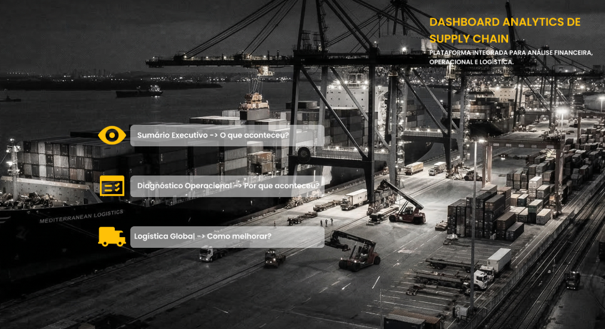
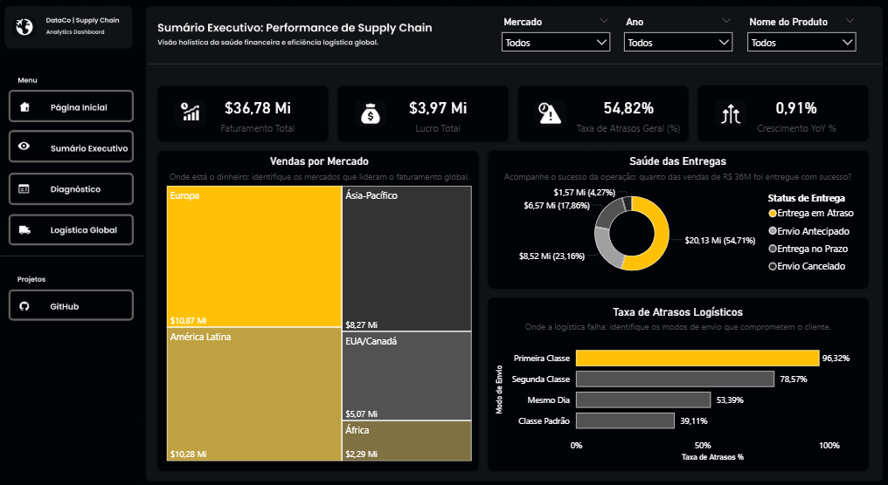
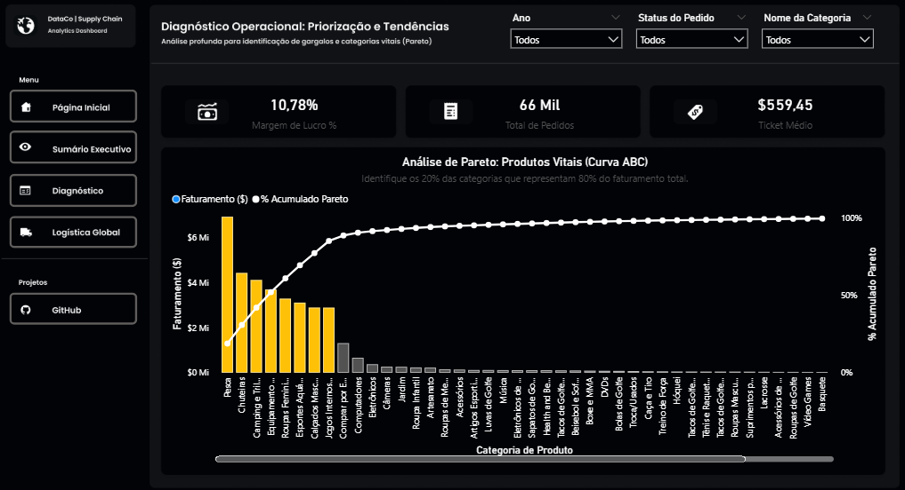
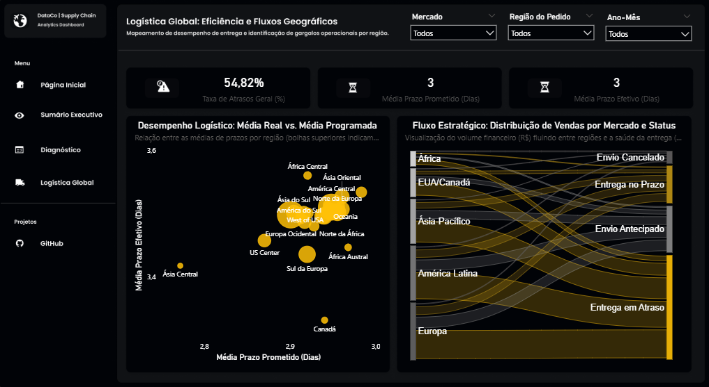

# 🚚 Supply Chain Analytics Dashboard (v1.7)

-green)

---

### 🌐 [🇧🇷 Português](#-português) | [🇺🇸 English](#-english)

---

## 🇧🇷 Português

### 📋 Visão Geral do Projeto
Este dashboard foi desenvolvido para fornecer uma visão estratégica e operacional de uma cadeia de suprimentos global. O foco principal é a identificação de gargalos logísticos, análise de faturamento e eficiência de entrega, utilizando técnicas avançadas de **Storytelling de Dados**.

> [!NOTE]
> **Fonte de Dados:** [DataCo Smart Supply Chain (Kaggle)](https://www.kaggle.com/datasets/shashwatwork/dataco-smart-supply-chain-for-big-data-analysis/data)

---
### 🔗 [Acessar Dashboard Online](https://app.powerbi.com/view?r=eyJrIjoiOTAxNWQ3OWItNTY0YS00ODZkLTllYWMtNGFhYjc5NDJkMjYzIiwidCI6IjI4NDVhN2ExLWQ3ZTMtNDBjNC1hMGYwLWY4NWI5OWY2Mjc2YyJ9&pageName=9cc429c8730794ab89d6)
---

### 🚀 Funcionalidades Principais
*   **Página Inicial (Portal):** Menu interativo guiado pela trilha de decisão: *Identificar, Diagnosticar e Otimizar*.
*   **Sumário Executivo:** Visão macro dos 4 KPIs gigantes (Faturamento, Lucro, Taxa de Atraso e Volume).
*   **Diagnóstico Operacional:** Análise de Pareto (ABC) dinâmica para identificação de categorias vitais e KPIs de eficiência (Margem, Ticket Médio e Volume).
*   **Logística Global:** Diagrama de Sankey para fluxos de carga entre mercados e análise de *Outliers* de prazo (Média Real vs. Programada).

### 💡 Insights Reais Identificados (Dados v1.7)
*   **Gargalo Premium:** A modalidade **"Primeira Classe"** apresenta a maior taxa de atraso (**96,32%**), indicando uma falha crítica na entrega do serviço de maior valor.
*   **Concentração de Faturamento:** O mercado da **Europa** lidera com **$10,87 Mi**, seguido de perto pela **América Latina ($10,28 Mi)**, representando quase **60%** do faturamento global.
*   **Crescimento Estagnado:** O crescimento YoY de apenas **0,91%** sugere a necessidade de novas estratégias de expansão de mercado ou retenção.
*   **Eficiência de Categoria (Pareto):** 8 categorias principais (lideradas por **Pesca** e **Chuteiras**) concentram **85,25%** do faturamento total, permitindo uma gestão de estoque ultra-focada.
*   **Gargalos Geográficos:** **África Central** e **Ásia Oriental** são os maiores *outliers* em tempo de atraso, enquanto **Europa** e **América Latina** lideram o volume total de fluxos e entregas no Sankey.

> [!TIP]
> **Nota de Dinamismo:** Como o dashboard é **totalmente interativo**, os insights acima referem-se à visão geral. Todos os valores são recalculados instantaneamente ao aplicar filtros de Mercado, Ano, Categoria, etc.

### 🖼️ Preview do Dashboard

*Página Inicial*

*Sumário Executivo*

*Diagnóstico*

*Logística Global*

### 🛠️ Diferenciais Técnicos
*   **Modelo de Dados:** Arquitetura Star Schema (Fatos e Dimensões) otimizada.
*   **DAX Avançado:** Desenvolvimento de uma biblioteca robusta de medidas, contemplando KPIs de performance, inteligência de tempo e lógica de negócios dinâmica.
*   **Design Premium:** Tema Dark Mode sofisticado e ícones customizados.
*   **Localização:** Interface totalmente traduzida para Português (PT-BR).

---

## 🇺🇸 English

### 📋 Project Overview
This dashboard was developed to provide strategic and operational insights into a global supply chain. The primary focus is identifying logistical bottlenecks, analyzing revenue, and delivery efficiency using advanced **Data Storytelling** techniques.

> [!NOTE]
> **Data Source:** [DataCo Smart Supply Chain (Kaggle)](https://www.kaggle.com/datasets/shashwatwork/dataco-smart-supply-chain-for-big-data-analysis/data)

---
### 🔗 [Access Online Dashboard](https://app.powerbi.com/view?r=eyJrIjoiOTAxNWQ3OWItNTY0YS00ODZkLTllYWMtNGFhYjc5NDJkMjYzIiwidCI6IjI4NDVhN2ExLWQ3ZTMtNDBjNC1hMGYwLWY4NWI5OWY2Mjc2YyJ9&pageName=9cc429c8730794ab89d6)
---

### 🚀 Key Features
*   **Home Page (Portal):** Interactive menu guided by the decision path: *Identify, Diagnose, and Optimize*.
*   **Executive Summary:** Macro view of the 4 "Giant" KPIs (Revenue, Profit, Delay Rate, and Volume).
*   **Operational Diagnosis:** Dynamic Pareto (ABC) Analysis to identify vital categories and efficiency KPIs (Margin, Average Ticket, and Volume).
*   **Global Logistics:** Sankey Diagram for cargo flows between markets and Outlier analysis (Actual vs. Promised lead times).

### 💡 Real Data Insights (v1.7 Findings)
*   **Premium Bottleneck:** **"First Class"** shipping has the highest delay rate (**96.32%**), signaling a critical failure in the highest-value service level.
*   **Revenue Concentration:** **Europe** leads with **$10.87M**, followed by **Latin America ($10.28M)**, together representing almost **60%** of global revenue.
*   **Stagnant Growth:** The **0.91%** YoY growth suggests a need for new market expansion or customer retention strategies.
*   **Category Efficiency (Pareto):** 8 key categories (led by **Fishing** and **Cleats**) account for **85.25%** of total revenue, enabling ultra-focused inventory management.
*   **Geographic Bottlenecks:** **Central Africa** and **East Asia** are the largest outliers in delay time, while **Europe** and **Latin America** lead the total volume of flows and deliveries in the Sankey.

> [!TIP]
> **Dynamic Note:** Since the dashboard is **fully interactive**, the insights above refer to the general view. All values are instantly recalculated when applying Market, Year, Category filters, etc.

### 🖼️ Dashboard Preview

*Home Page*

*Executive Summary*

*Diagnosis*

*Global Logistics*

### 🛠️ Technical Highlights
*   **Data Model:** Optimized Star Schema (Fact and Dimension) architecture.
*   **Advanced DAX:** Dynamic ranking measures, conditional formatting, and time intelligence (YoY).
*   **Premium Design:** Sophisticated Dark Mode theme and custom icons.
*   **Localization:** Fully localized interface for Portuguese (PT-BR) 

---

### 📂 Estrutura do Repositório / Repository Structure

| Pasta / Folder | Descrição (PT-BR) | Description (EN) |
| :--- | :--- | :--- |
| **`/assets`** | Papéis de parede customizados. | Custom wallpapers. |
| **`/data`** | Base de dados bruta (CSV). | Raw database files (CSV). |
| **`/docs`** | Capturas de tela do Dashboard. | Dashboard screenshots. |
| **`/powerbi`** | Arquivo de projeto do Power BI (.pbip). | Power BI project file (.pbip). |
| **`LICENSE`** | Licença de uso do projeto. | Project license. |

---

**Desenvolvido por Leonardo Serpa** 🚀
